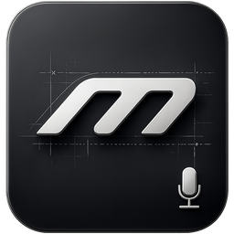
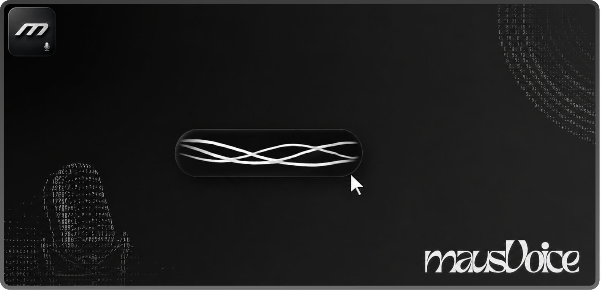
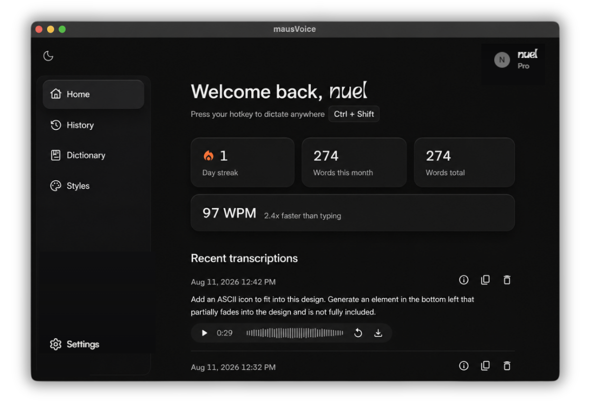
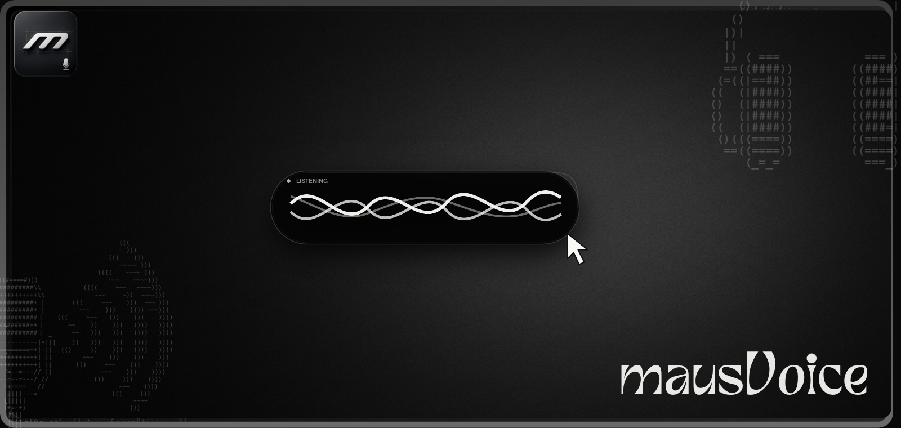
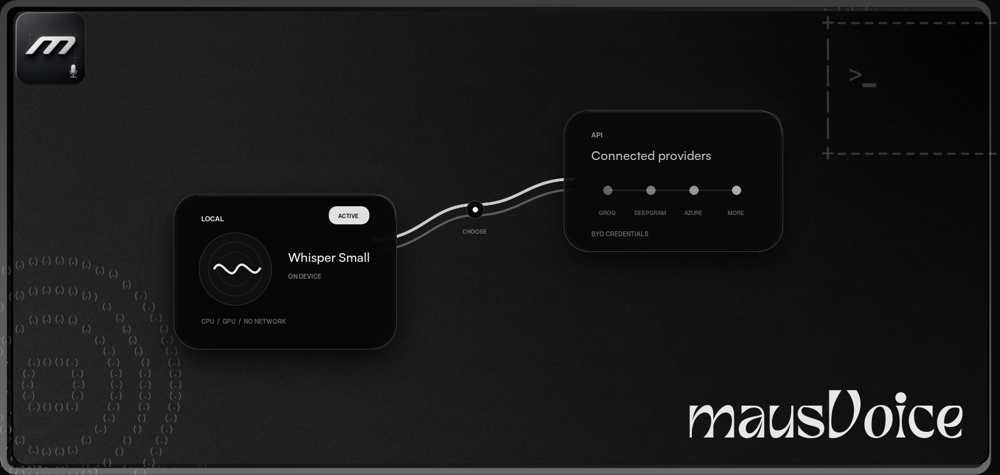
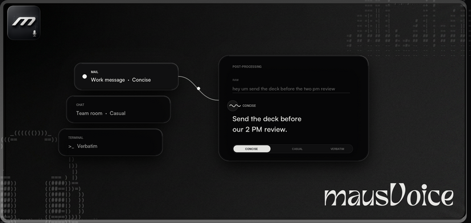
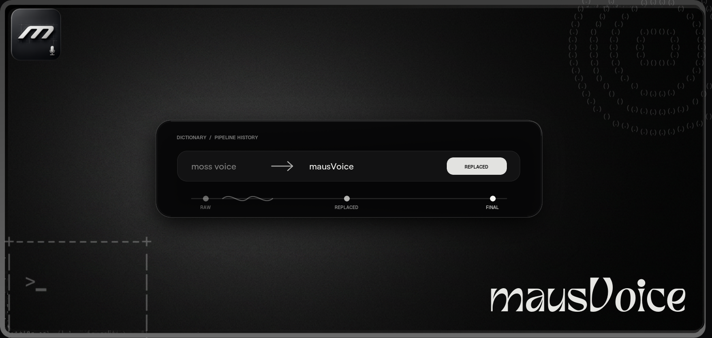
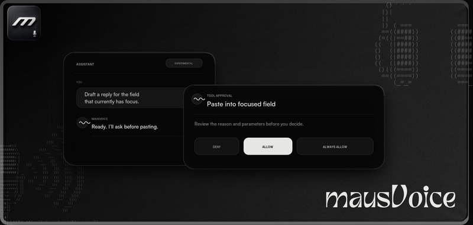
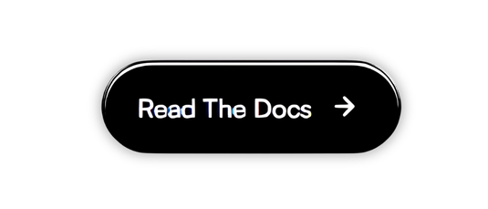

<a id="readme-top"></a>

<div align="center">
  

  <h1>mausVoice</h1>

  <p>
    <strong>Private, fast voice typing for your own machine.</strong><br />
    Dictate into any app, choose local or cloud transcription, and keep control of the pipeline.
  </p>

  <p>
    <a href="https://github.com/maus-inc/mausVoice/actions/workflows/test-desktop-unit.yml"></a>
    <a href="https://github.com/maus-inc/mausVoice/releases/latest"></a>
  </p>

  <p>
    <a href="https://github.com/maus-inc/mausVoice/releases/latest"><strong>Download mausVoice</strong></a>
    &nbsp;·&nbsp;
    <a href="https://maus-inc.github.io/mausVoice/docs/">Documentation</a>
    &nbsp;·&nbsp;
    <a href="#build-from-source">Build from source</a>
  </p>
</div>

<br />

<p align="center">
  
</p>

mausVoice is a cross-platform desktop dictation app built with Rust and [Tauri](https://tauri.app/). There is no required account, subscription, or managed backend. Run transcription locally, connect your own provider keys, and decide whether post-processing should happen at all.

## How it works

1. **Hold** your configured push-to-talk shortcut and speak.
2. **Transcribe** locally or through a provider you choose.
3. **Shape** the result with an optional writing style, dictionary, or LLM pass.
4. **Deliver** the text by clipboard paste, direct typing, or copy-only mode.

> [!TIP]
> Start fully local, or connect your own [Deepgram](https://console.deepgram.com/signup) and [Groq](https://console.groq.com/keys) keys for hosted transcription and post-processing.

<p align="center">
  
</p>

## Features

Every stage is configurable: capture globally, select the transcription path that fits the moment, then control exactly how the finished text reaches the focused app.

<p align="center">
  <a href="#global-dictation">Global dictation</a>
  &nbsp;·&nbsp;
  <a href="#transcription-engines">Transcription engines</a>
  &nbsp;·&nbsp;
  <a href="#writing-styles">Writing styles</a>
  &nbsp;·&nbsp;
  <a href="#dictionary-and-history">Dictionary &amp; history</a>
  &nbsp;·&nbsp;
  <a href="#assistant-approval">Assistant</a>
</p>

<br />

<a id="global-dictation"></a>

<p align="center">
  
</p>

<p align="center"><sub><strong>01 / GLOBAL DICTATION</strong></sub></p>
<h3 align="center">Your voice, in the field with focus</h3>

<p align="center">
  Hold a global push-to-talk shortcut and speak into the app you are already using.<br />
  mausVoice can paste, type directly, or leave the result on your clipboard.
</p>

<br />

<a id="transcription-engines"></a>

<p align="center">
  
</p>

<p align="center"><sub><strong>02 / TRANSCRIPTION ENGINES</strong></sub></p>
<h3 align="center">Local or hosted—pick the transcription path.</h3>

<p align="center">
  Run Whisper, Parakeet, or Canary locally on CPU or a detected Vulkan GPU, or choose a hosted provider.<br />
  Bring your own credentials; local recognition stays on-device once its model is downloaded.
</p>

<br />

<a id="writing-styles"></a>

<p align="center">
  
</p>

<p align="center"><sub><strong>03 / WRITING STYLES</strong></sub></p>
<h3 align="center">Say it once. Shape it for the destination.</h3>

<p align="center">
  Create reusable instructions for email, chat, terminal work, or any voice you need.<br />
  Choose the style before recording, or switch post-processing off for a literal transcript.
</p>

<br />

<a id="dictionary-and-history"></a>

<p align="center">
  
</p>

<p align="center"><sub><strong>04 / DICTIONARY &amp; HISTORY</strong></sub></p>
<h3 align="center">Teach it your vocabulary. Keep the useful trail.</h3>

<p align="center">
  Add replacement rules for names, acronyms, and phrases that general models miss.<br />
  Review raw and final text, play retained audio, or retranscribe a saved clip with current settings.
</p>

<br />

<a id="assistant-approval"></a>

<p align="center">
  
</p>

<p align="center"><sub><strong>05 / ASSISTANT</strong></sub></p>
<h3 align="center">Ask for action. Approve every command.</h3>

<p align="center">
  Use voice or text to work with the built-in Assistant and its permissioned tools.<br />
  Requests pause for Deny, Allow, or Always allow; Power Mode keeps shell access off until enabled.
</p>

<br />

<div align="center">
  <h2>Use your voice anywhere you can type.</h2>
  <p>Download the latest desktop build. No account required.</p>
  <p>
    <a href="https://github.com/maus-inc/mausVoice/releases/latest"></a>
    <a href="https://github.com/maus-inc/mausVoice/releases/latest"></a>
    <a href="https://github.com/maus-inc/mausVoice/releases/latest"></a>
  </p>
  <p><a href="https://github.com/maus-inc/mausVoice/releases/latest"><strong>View the latest release →</strong></a></p>
</div>

## Documentation

The [mausVoice documentation](https://maus-inc.github.io/mausVoice/docs/) covers installation, first-run setup, dictation, providers, models, troubleshooting, and development.

<p align="center">
  <a href="https://maus-inc.github.io/mausVoice/docs/"></a>
</p>

## Develop

<a id="build-from-source"></a>

<details>
<summary><strong>Build mausVoice from source</strong></summary>

### Requirements

- Node.js 20 or newer
- pnpm 10
- Rust stable toolchain
- The platform-specific [Tauri prerequisites](https://tauri.app/start/prerequisites/)

### Run the desktop app

```bash
git clone https://github.com/maus-inc/mausVoice.git
cd mausVoice
pnpm install
cd apps/desktop
pnpm dev:mac        # macOS
pnpm dev:windows    # Windows
pnpm dev:linux      # Linux
```

Native features require the platform-specific desktop command rather than the root `pnpm dev` command.

### Useful commands

From the repository root:

```bash
pnpm build          # Build all workspace packages
pnpm lint           # Run workspace linters
pnpm check-types    # Check TypeScript types
pnpm test           # Run workspace tests
```

For repository structure, environment variables, testing strategy, and release details, see the [development documentation](https://maus-inc.github.io/mausVoice/docs/development/repository-overview/).

</details>

## License

mausVoice is distributed under the [GNU Affero General Public License v3.0](LICENCE).

Maintained by [Maus](https://github.com/maus-inc).

<p align="right"><a href="#readme-top">Back to top ↑</a></p>
