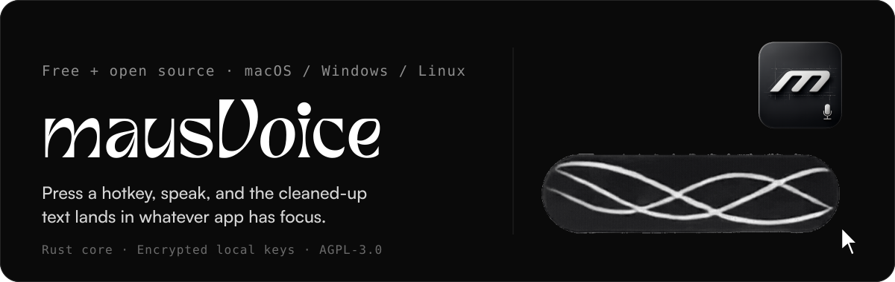

<p align="center">
  
</p>

<p align="center">
  <a href="LICENCE">
    
  </a>
  <a href="https://github.com/maus-inc/mausVoice/actions">
    
  </a>
  <a href="https://github.com/maus-inc/mausVoice/releases">
    
  </a>
  <a href="https://github.com/maus-inc/mausVoice/releases">
    
  </a>
  <a href="https://github.com/maus-inc/mausVoice/releases">
    
  </a>
</p>

**mausVoice** turns your voice into text anywhere you can type. Hold a
global shortcut, speak, and release. It transcribes locally or through
your chosen provider, lets an LLM clean up the rough transcript, and
types the result into the field in focus. No account, no subscription,
and the Rust core keeps CPU and memory usage low.

<p align="center">
  
</p>

## Documentation

Platform setup, daily dictation, every configuration area, provider
behavior, privacy and local data, troubleshooting, and repository
architecture all live in the
[mausVoice documentation][docs].

<p align="center">
  <a href="https://maus-inc.github.io/mausVoice/docs/">
    
  </a>
</p>

## How it works

1. Press your hotkey and speak. A small overlay shows you are recording.
2. Audio is captured natively and transcribed as it happens, streamed
   through Deepgram (`nova-3`) or fully locally with Whisper.
3. An LLM removes filler, fixes punctuation and formatting, and applies
   your chosen writing style.
4. The finished text is typed into whatever app has focus.

<p align="center">
  
</p>

## Features

|                          |                                                                                                                              |
| ------------------------ | ---------------------------------------------------------------------------------------------------------------------------- |
| **Live transcription**   | The streaming `nova-3` transcript appears while you are still speaking, so it is ready before you release the hotkey.        |
| **Fully local option**   | Run Whisper locally (CPU or GPU) with zero network calls for transcription.                                                  |
| **AI cleanup**           | Removes filler words and fixes punctuation. Choose a writing style and the result reads like you wrote it.                   |
| **Your keys, encrypted** | Deepgram and Groq keys live on your machine, encrypted with XChaCha20-Poly1305. Rotate them any time without rebuilding.     |
| **Personal dictionary**  | Add your names, jargon, and shorthand once and mausVoice remembers them.                                                     |
| **Works in every app**   | The overlay captures audio globally and pastes the result into whatever has focus.                                           |

## Download

<p align="center">
  <a href="https://github.com/maus-inc/mausVoice/releases">
    
  </a>
  <a href="https://github.com/maus-inc/mausVoice/releases">
    
  </a>
  <a href="https://github.com/maus-inc/mausVoice/releases">
    
  </a>
</p>

The [releases page][releases] has the latest `.exe` (Windows), `.dmg`
(macOS), and `.AppImage`/`.deb` (Linux). New here, or unsure whether your
machine is supported? Check
[system requirements][system-requirements], then follow the
[first dictation][first-dictation] walkthrough.

## API keys

You can skip this section entirely: with no keys at all, mausVoice runs
local Whisper for transcription and turns cleanup off. To go further, two
free keys, both entered in Settings:

- **Deepgram** for streaming transcription: get one at
  [console.deepgram.com][deepgram].
- **Groq** for LLM cleanup: get one at [console.groq.com/keys][groq].

Keys are stored encrypted on your machine (XChaCha20-Poly1305) and can be
changed or rotated any time in Settings, without rebuilding.

<details>
<summary>Developer quick start</summary>

## Quick start

You will need macOS, Windows, or Linux, plus Node 20+, pnpm 10, and a
Rust toolchain (see the [Tauri prerequisites][tauri-prereqs]).

```bash
pnpm install
```

Then run the desktop app with the platform-specific command:

```bash
cd apps/desktop
pnpm dev:mac        # macOS
pnpm dev:windows    # Windows
pnpm dev:linux      # Linux
```

> `pnpm dev` alone will not work. Native features need the
> platform-specific command above.

On first launch, onboarding asks for your transcription and cleanup keys.
There are no build-time secrets, and the same binary works with local
Whisper if you leave both keys empty.

### Build and quality

From the repo root:

```bash
pnpm run build         # build all workspaces (turborepo)
pnpm run lint          # lint
pnpm run check-types   # TypeScript type checking
pnpm run test          # tests
```

All development documentation is
[here][dev-docs].

</details>

## Contributing

Issues, feature requests, and pull requests are welcome. Read the
[contributing guide][contributing] for setup, conventions, and how to get
changes reviewed.

## License

[AGPL-3.0](LICENCE). Built on [Tauri](https://tauri.app), with the
frontend in React and the audio and overlay layer in Rust.

Maintainer: [Owie Emmanuel](https://github.com/Owie6789)

[docs]: https://maus-inc.github.io/mausVoice/docs/
[releases]: https://github.com/maus-inc/mausVoice/releases
[system-requirements]: https://maus-inc.github.io/mausVoice/docs/getting-started/system-requirements/
[first-dictation]: https://maus-inc.github.io/mausVoice/docs/getting-started/first-dictation/
[deepgram]: https://console.deepgram.com/
[groq]: https://console.groq.com/keys
[tauri-prereqs]: https://v2.tauri.app/start/prerequisites/
[dev-docs]: https://maus-inc.github.io/mausVoice/docs/development/repository-overview/
[contributing]: https://maus-inc.github.io/mausVoice/docs/project/contributing/
