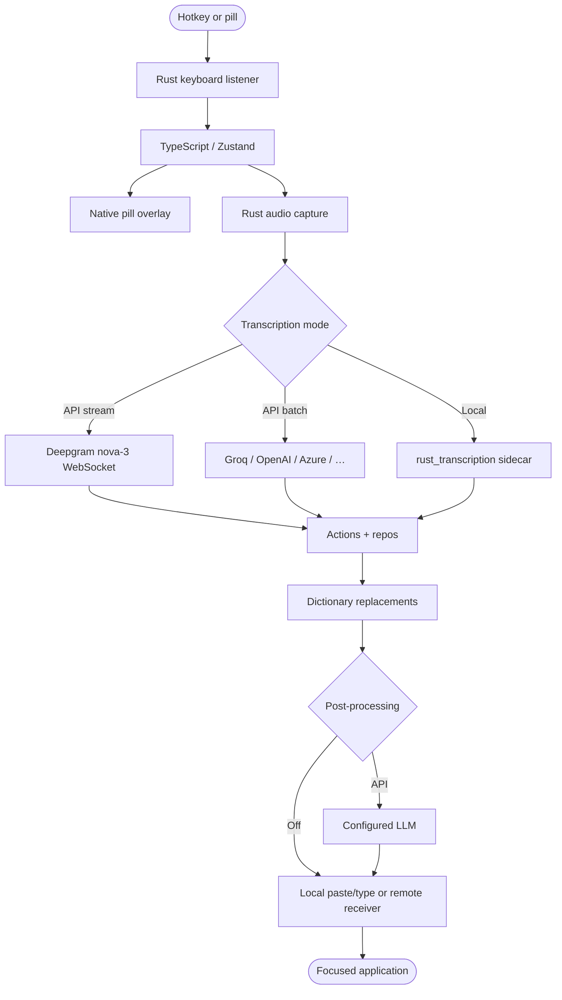
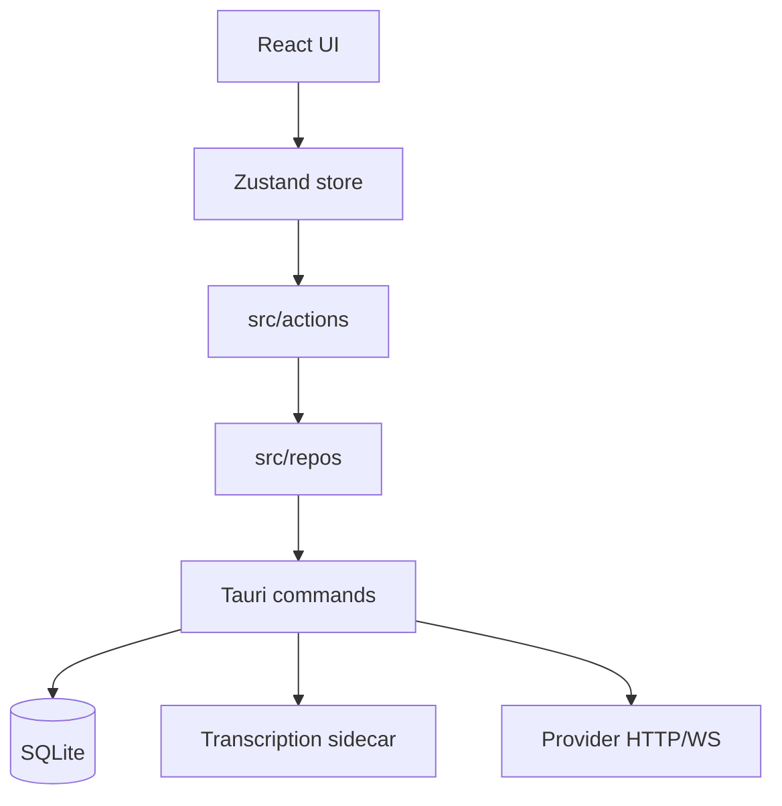
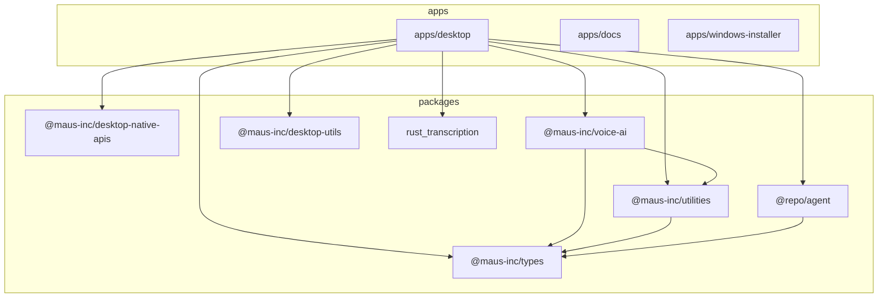

mausVoice is a Tauri v2 desktop application. The React/TypeScript frontend owns product orchestration; Rust owns privileged desktop capability. Generated wrappers in `@maus-inc/desktop-native-apis` are the typed invoke boundary between them.

The project slogan **“Rust is the API, TypeScript is the Brain”** is a real constraint: Zustand actions decide *what* happens; Rust commands perform *how* (audio, hotkeys, insertion, SQLite, crypto, sidecars). Do not duplicate provider or style selection in Rust.

## System components

| Component | Responsibility | Technologies |
| --- | --- | --- |
| Frontend | Business logic, state, UI | React 19, TypeScript, Zustand, Immer, MUI |
| Tauri host | Native bridge, encryption, paths | Rust, Specta bindings |
| Storage | History, prefs, encrypted keys | SQLite (`mausvoice.db`) |
| Transcription | Speech → text | Deepgram `nova-3` (stream), Groq/other APIs (batch), local Whisper/ONNX sidecar |
| Cleanup | Optional rewrite / styles | Groq, OpenRouter, OpenAI, Gemini, Claude, Ollama, … |
| Overlay | Recording / Assistant HUD | Native pills (embedded macOS; sidecar Windows/GTK) |

## High-level dictation flow



A normal dictation also follows this ownership path:

```text
global key or pill event
  → DictationSideEffects / dictation strategy
  → native audio recorder + selected TranscriptionSession
  → local sidecar or hosted provider
  → replacement rules
  → optional generative post-processing/style
  → history/audio persistence (unless Incognito)
  → local insertion or remote delivery
  → Zustand state and pill/status updates
```

Local transcription **does not** imply post-processing is off. Review both task settings and any multi-device output before claiming an offline path.

## Frontend layers

`apps/desktop/src/actions/` performs stateful operations. `strategies/dictation.strategy.ts` handles dictation processing choices, while `components/root/DictationSideEffects.tsx` connects global events, the recorder, session lifecycle, timers, and output. `sessions/` separates dedicated AssemblyAI, Azure, Deepgram, ElevenLabs, Gladia, and Local lifecycles from retained-audio batch transcription.



Repositories under `repos/` select storage, model-provider, transcription, and generation implementations. Provider HTTP/WebSocket details generally belong in `packages/voice-ai`; local sidecar process/lease management belongs under `sidecars/`. Zustand/Immer slices under `state/` are combined by `store/` and rendered by React components.

## Native capabilities

The Tauri backend exposes recording, keyboard, focus, insertion, clipboard, permissions, paths, encrypted keys, diagnostics, SQLite queries, native overlays, and remote-output transport.

- **Audio capture:** native microphone stream for streaming and batch paths.
- **Keyboard injection:** `paste` (clipboard + shortcut) or `simulate_type` (rdev key events).
- **Global shortcuts:** platform listeners / compositor bindings; TypeScript syncs a grab fingerprint.
- **Sidecars:** Whisper.cpp GGML and ONNX Parakeet/Canary run *outside* the main process.
- **Encryption:** API keys at rest use XChaCha20-Poly1305 with a per-record nonce. Keys are never baked into the binary.

Windows and GTK pills are separate processes; the macOS pill is embedded with channels.

## Source layout (`apps/desktop`)

```text
src/
├── actions/         # Business-logic orchestration
├── components/      # React UI
├── hooks/           # Reactive store access
├── repos/           # SQLite / AI provider access
├── sessions/        # Live transcription transports
├── sidecars/        # Local process leases
├── state/           # Zustand slices
├── strategies/      # Dictation behavior
├── tools/           # Assistant tools
└── utils/           # Pure helpers (prompts, strings, tones)
src-tauri/           # Rust API, migrations, platform overlays
```

## Workspace graph



The agent package name is **`@repo/agent`**, not `@maus-inc/agent`.

## Design system (verified)

The UI is an operate-mode, high-density tool surface. Elevation is a **luminance ladder**, not heavy drop shadows:

| Tier | Light (Cream) | Dark (Onyx) |
| --- | --- | --- |
| level0 background | `#F5F2ED` | `#0C0C0D` |
| level1 surface | `#FDFBF8` | `#161617` |
| level2 raised | `#ECE8E1` | `#1F1F21` |
| level3 elevated | `#E0DBD2` | `#2A2A2C` |

Primary action blue is `#1B8AF8` / `#3198FF`. Body type is Satoshi (or Plus Jakarta) with tabular numerals; TAN-PARADISO is reserved for branding. See `apps/desktop/DESIGN.md`.

## Boundaries to preserve

A UI component should not hand-roll provider auth or SQL. Rust should expose a narrow native primitive rather than deciding which AI provider or style wins. When a cross-boundary type changes, update Rust, generated bindings, TypeScript consumers, and failure handling together.
