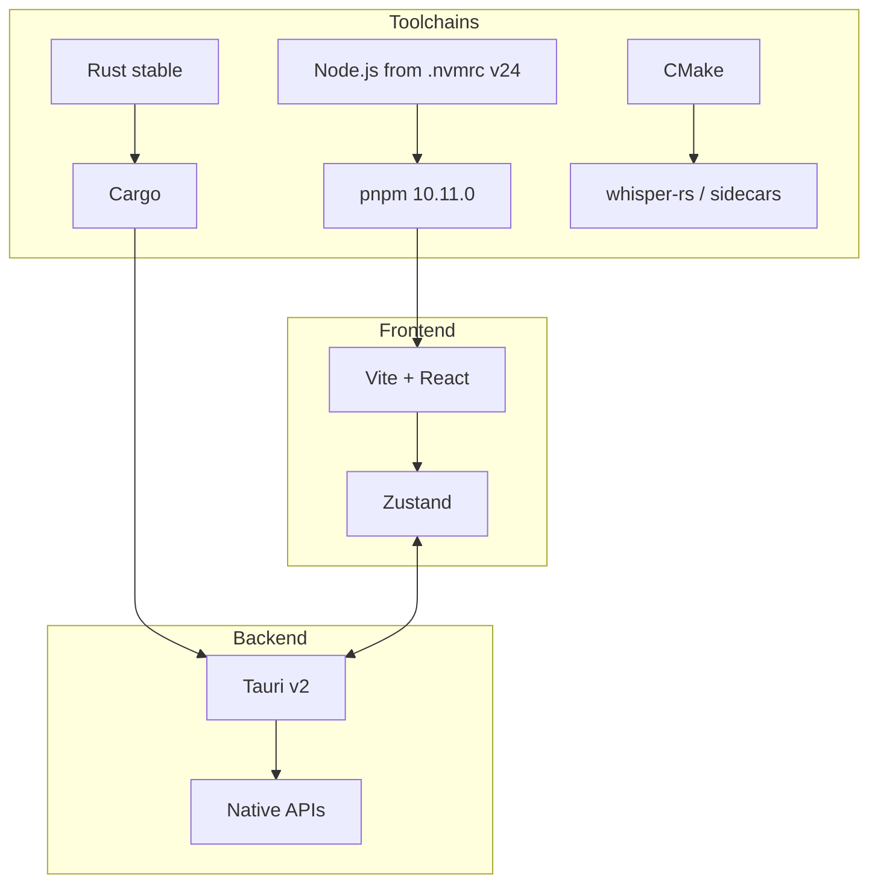

Use Node from `.nvmrc`—currently **v24**. The root `engines.node` floor is `>=20`. Wiki notes that say “Node 18+” are outdated; CI follows `.nvmrc`. Enable Corepack or install the exact package manager from the root manifest, **pnpm 10.11.0**, then install from the repository root:

```bash
corepack enable
pnpm install --frozen-lockfile
```

Install **stable Rust** (Tauri v2; 1.77+ is the historical floor) plus OS prerequisites. **CMake** is required for `whisper-rs`. macOS needs Xcode CLT; Windows needs Visual Studio Build Tools. Linux also needs audio, WebKit/GTK, layer-shell, X11/uinput, compiler, CMake, and libclang; `.github/scripts/install-desktop-linux-deps.sh` is the closest Ubuntu reference. On macOS you can also run `./scripts/setup-macos.sh` to check the toolchain.



## Start the desktop app

From `apps/desktop`, use the matching platform command:

```bash
pnpm dev:mac
pnpm dev:windows
pnpm dev:linux
```

Each sets `TAURI_PLATFORM`, runs `scripts/prepare-sidecars.mjs`, and starts Tauri with `src-tauri/tauri.local.conf.json` unless `TAURI_DEV_CONFIG` overrides it. Local flavor uses the separate identifier `com.mausinc.desktop.local`, which prevents normal development from sharing every OS-level identity with a production install. Generic `pnpm dev` runs the platform-selection script; explicit commands make bug reports repeatable.

`pnpm --filter desktop build` compiles TypeScript and the Vite frontend only. A packaged native build goes through the desktop `tauri` script or an OS-specific Tauri build command and needs sidecars present.

### Environment variables

| Variable | Role |
| --- | --- |
| `VITE_FLAVOR` | Frontend flavor (`dev`, `prod`, `enterprise`) |
| `MAUSVOICE_ENABLE_DEVTOOLS` | Open webview devtools on launch |
| `MAUSVOICE_DESKTOP_PLATFORM` | Override platform detection for Node scripts |
| `TAURI_PLATFORM` | Native target used by desktop scripts and Turbo cache |
| `TAURI_DEV_CONFIG` | Alternate Tauri config for `dev:tauri` |

Turbo also tracks Firebase emulator hosts so those values invalidate the cache.

Shared packages compile to `dist/`. After changing `@maus-inc/types`, `@maus-inc/utilities`, `@maus-inc/voice-ai`, or `@repo/agent`, rebuild (`pnpm run build` or `pnpm exec turbo run build --filter=desktop^...`) before the desktop app sees the change.

## Validate a change

Root `build`, `lint`, `check-types`, and `test` commands fan out through Turbo to workspaces that define those tasks. Run focused desktop unit tests before broader checks. Provider-backed integration tests require their documented environment variables; ordinary UI, repository, and sidecar unit tests must not depend on personal credentials. Keep `.env` files and generated secrets untracked.
